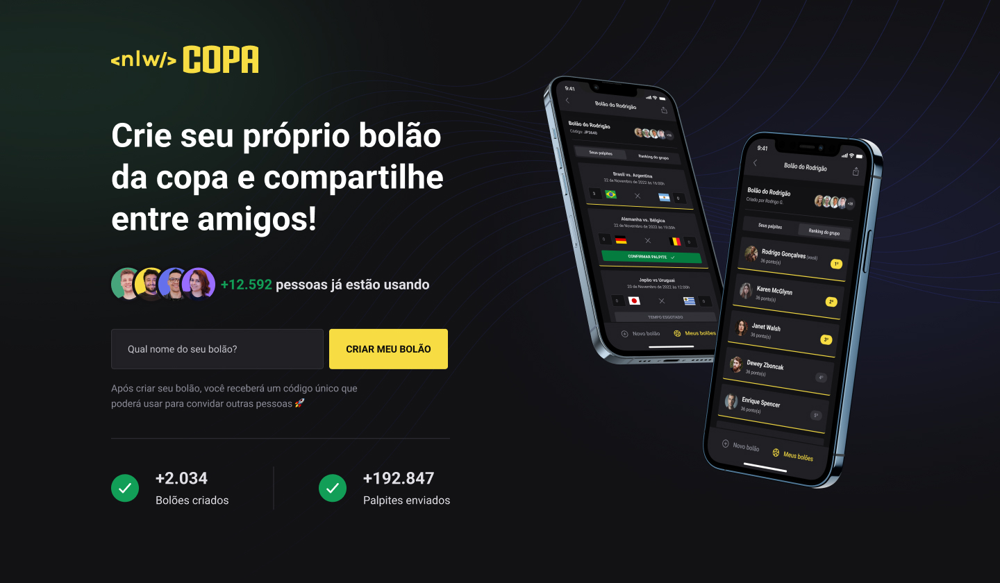

<h1 align="center"> NLW #10 Copa - Ignite </h1>

Projeto desenvolvido durante o NLW #10 - Copa, na trilha Ignite. O
NLW é um Evento exclusivo e gratuito, promovido pela Rocketseat para ensino de tecnologias WEB.

  <a href="#-tecnologias">Tecnologias</a>&nbsp;&nbsp;&nbsp;|&nbsp;&nbsp;&nbsp;
  <a href="#-projeto">Projeto</a>&nbsp;&nbsp;&nbsp;|&nbsp;&nbsp;&nbsp;
  <a href="#-layout">Layout</a>&nbsp;&nbsp;&nbsp;|&nbsp;&nbsp;&nbsp;
  <a href="#memo-licença">Licença</a>

  

 

## 🚀 Tecnologias

Esse projeto foi desenvolvido com as seguintes tecnologias:

- Typescript
- Node.js / Prisma
- React / Next.js
- React-Native

## 💻 Projeto

O Bolão da Copa é um projeto que permite criar bolões e dar palpites nos resultados dos jogos da Copa de 2022. O projeto consiste em um servidor em Node.js, uma interface web para criação de bolões e um aplicativo mobile para acompanhar os bolões e dar palpites.

## 🔖 Layout

Você pode visualizar o layout do projeto através [DESSE LINK](https://www.figma.com/community/file/1169028343875283461). É necessário ter conta no [Figma](https://figma.com) para acessá-lo.

  

## :memo: Licença

Esse projeto está sob a licença MIT.

---